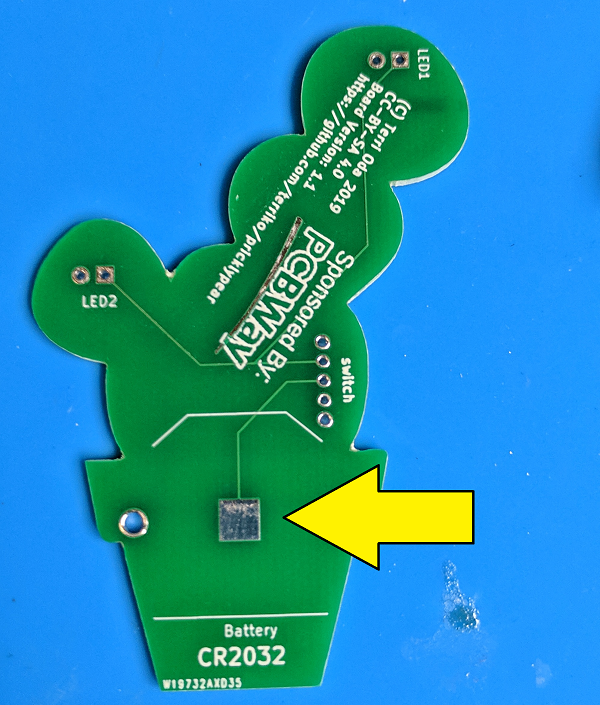
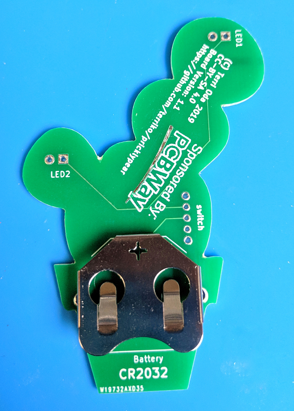
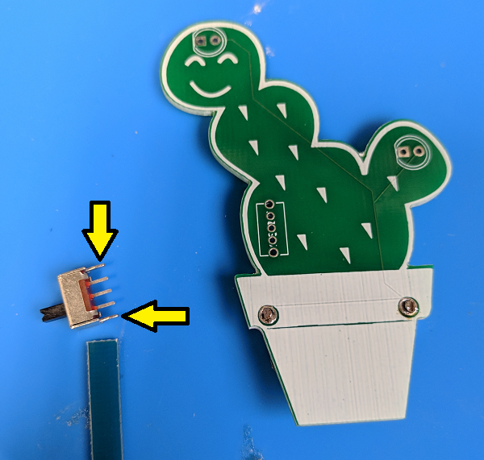
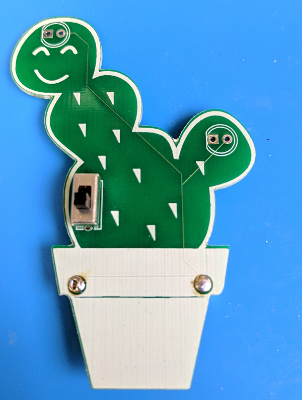
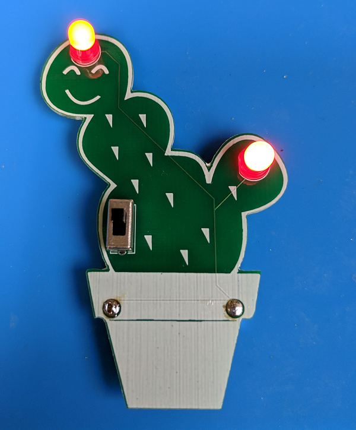

# Prickly Pear Soldering Kit
(c) Terri Oda 2019
License: CC-BY-SA 4.0

When I first moved from Ottawa to Albuquerque, I was fascinated by the cactus growing everywhere, because I'd never seen so many in the wild.  This soldering kit uses red LEDs to make prickly pear fruit.  Sure, real prickly pears don't glow, but given New Mexico's place in nuclear history, it's not too much of a stretch to imagine that they might have in some alternate history.

## Instructions

The parts can be soldered on in any order, but I recommend starting with the battery holder first since the connections are bigger for people who've never soldered before and want a big target to hit on the first try.

### 1. Battery Holder

1. Flip the board over so you're looking at the back.
2. Cover the square near the bottom (above the word "battery") with solder.

3. The battery holder is the big metal piece with a + cut into it and a couple of clips.  Put it in place over the square.  The + sign will be at the top and opening where you insert the battery will be at the bottom.  Push the clips through the big holes on either side of the flower pot.

4. Flip the board over so that you're looking at the front
5. Solder the two clips in place.

### 2. Switch

When I made the board, I made 5 holes for this switch, but the outer two are a bit too small, so we won't be using those.

1. Cut the outermost legs off the switch.  You probably want to wear eye protection for this in case bits go flying.  Those outer legs are a bit wider than the others.  Be careful not to cut the inner three pins!

2. Stick the switch in the space labelled "switch" on the back of the board.  The pins should stick out the back and the switch itself should be on the front.  

3. Make sure your three remaining pins are in the inner three slots.
4. Solder each pin separately.  You might notice that the bottom pin isn't connected to anything, so you don't *need* to solder it, but you probably want to just for stability.

### 3. LEDs

1. The LEDs go in the top of each "arm" of the prickly pear and they're marked as LED1 and LED2 on the back of the board.  
2. The drawing on the board shows a circle with one flat side -- your LEDs also have one flat side so make sure they match up.  Or, if you prefer, you can remember that the **s**quare hole is for the **s**hort leg of the LED (they both start with **s**).  Some people also remember that the short leg goes on the short side, since the flat side is shorter than the round one. 
3. Once you know how to line them up, stick one LED the appropriate holes with the light on the front of the board and the wires sticking out the back.  
4. Bend the wires out a bit so it stays in place while you're working.
5. Solder each wire separately.
6. Repeat steps for the second LED.
7. Cut the excess wire off the back of your board.  You might want to wear eye protection in case they go flying!

### 4. Magnet

1. The white side of the magnet is a sticker.  You can put it wherever you want, but I put it on the battery cover so it was easy to stick it on the fridge if I didn't want to wear it as a badge.

### 5. Battery

1. Stick the battery in the battery holder with the positive side up (that's the one with the text on it).
2. If your lights don't turn on the second you put in the battery, flip the switch to turn them on!  

